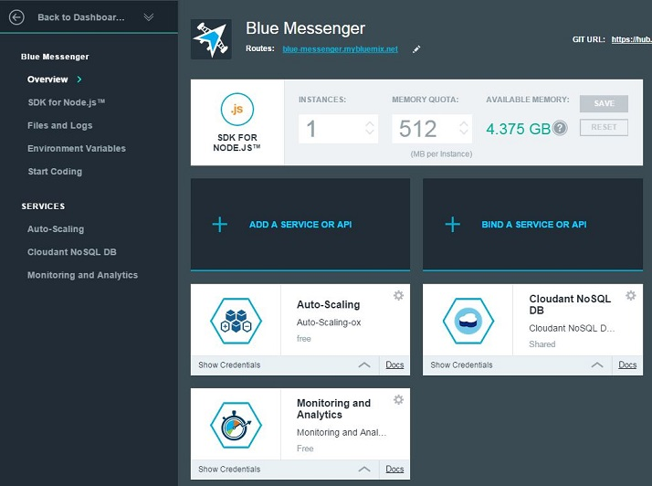
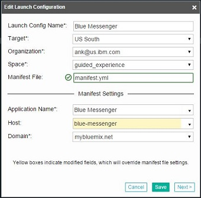

# Workload - Scalable Web App
	

###Scalable Web Application example implemented in Cloud Foundry 

The messaging web application utilizes and demonstrates
the Bluemix services "Monitoring and Analytics", "Autoscale", and "Cloudant NoSQL DB".

## Introduction

A messaging web application has been created so you can depoly it into your personal space
after signing up for Bluemix and the DevOps service. You will attach the
**Monitoring and Analytics**, **Auto-Scaling**, and **Cloudant NoSQL DB** services to the application as well as learn how to begin using these services.

## Sign up for / Log into Bluemix and DevOps

Sign up for Bluemix at https://console.ng.bluemix.net and DevOps Services at https://hub.jazz/net. When you sign up, you'll create an IBM id, create an alias, and register with Bluemix.

For more information, reference the Bluemix getting started documents at - 

## Create Node.js Application and Attach the Services
 
The goal is to create a Node.js application through the Bluemix UI. You will use the initial Node.js applicaiton to add Bluemix services.  Afterward, you will create and bind
a Cloudant NoSQL Database. This will be used to store messages that we send. We will then create and bind the Monitoring and Analytics
and Autoscaling services. Bluemix provides these services embedded in the Bluemix Service Catalog. Once we have created a Node.js application
with these services, we will set out to fork (copy) the application's code and deploy it over the starter Node.js application.

* Log into your Dashboard at https://console.ng.bluemix.net.
* From the Dashboard page select CREATE AN APP.
    
This will open a window to select either Web or Mobile.
	
* Select **Web**.
* In the next screen, select **SDK for Node.js**.
* Now, where it says **App Name**, specify a name for your web application and take note for when you fork your project.
	
It may take a while for the application to be created and staged. Once it finishes staging, you will have succesfully
created a starter Node.js application in Bluemix. You should now see the application in your Dashboard in the
"Applications" category. We will now bind services to our starter Node.js application. 

* In the left sidebar, select Overview to take you into the application's dashboard where we can add/bind services.
* Click **ADD A SERVICE OR API**. This directs you to the Services Catalog. 
* In the top search bar, type "cloudant"
* From the **Data Management** category, select **Cloudant NoSQL DB**.

	
This will bring up a page where you will configure the Cloudant service.

* Accept the default values.
* Make note of your **Service name** that you will use later.
* Click **CREATE**.
* Restage your application when prompted.

You have successfully deployed and binded an instance of Cloudant NoSQL DB to your starter Node.js application. 

At this point, we have our starter Node.js application with a binded instance of a Cloudant database. Using what you've learned, add the services **Monitoring and Analytics** and **Auto-Scaling** to your application.

Once you have successfully bound "Monitoring and Analytics" and "Auto-Scaling" services to your web application your app's dashboard should appear like this:

## Fork project to personal DevOps space 
	
Our next goal is to fork a publicly accessible repository hosted in http://hub.jazz.net into your 
personal DevOps space. Once we do this, we will be able to deploy the code to Bluemix and spin
up instances of the Web Application. 

* Navigate to [the tutorial's repository](https://hub.jazz.net/project/ank/Blue%20Messenger/overview)
* In top right of the page, click **Fork Project**
	* A menu will pop up where you will need to provide infomation on where the code will be forked 
	to.
* In **Name your project**, use name you chose for your starter Node.js app.
* Choose the **Space** that your starter Node.js app was created in and click **CREATE**. 

You have successfully forked this application code to your personal Jazz Hub space.
To find more about Bluemix's DevOps features reference the docs at 
https://hub.jazz.net/docs.

## Deploy to Bluemix through DevOps Services

You can now configure your application code for deployment to your own Bluemix environment.  You will be overwriting the deployed starter node application, taking advantage of the services you previously configured.

* On your DevOps Services project page, click **EDIT CODE** at the top right, this opens your web IDE.
	* In your web IDE you will see the a copy of this README.md that you forked.
* Click the drop-down menu, found above the code files, and select the pencil symbol to edit launch configuration.

A window will pop up and you will be required to enter information about where the code will be
deployed to.

* In the **Launch Config Name** field give a Config Name.
* In the **Target** field select your app's region.
* In the **Organization** field select your app's organization.
* In the **Space** field select your app's Bluemix space.
* In the **Manifest File** field leave the default of manifest.yml.
* In the **Application Name** field select the name of your starter Node.js application.
* In the **Host** field select the hostname you gave for your Node.js application.
* In the **Domain** field leave default at mybluemix.net.
* Click **Save**.

]

* To the right of the configuration dropdown, click the **Play** button to deploy your application to Bluemix.

* Navigate to your **Bluemix Dashboard** and select your application to view its deployment status.
* Once your application is finished deploying, click on the **Routes** link to be navigated to your new web app.

## What does the app do?

Your new web application is a simple web server that can recieve MQTT messages.  The server will write the contents of each message it recieves to your Cloudant database.
  The purpose of the application is to allow you to experiment with workloads and the Bluemix services.

Looking at your deployed application, you will see a **Messaging Rate** dropdown where you specify the rate at which messages 
are sent to the database. In the **Duration in Minutes** dropdown, you can select how many minutes
the automated messaging will persist. In the **Message** box, you can enter a message that will be sent to the database.
The message is optional when sending messages using the **Start** button. At the bottom of the webpage you will see **Start** and **Stop** buttons that you use
to initiate and stop the messaging.
	
* In the **Message** box put any message you would like to send.
	* You may send individual messages by clicking **Send a Message**
* Set the rate to "Medium".
* Set your duration to "5" minutes.
* Click **Start**.

You have just succesfully started sending messages to your web server. To see the messages populated, click on your
Cloudant service in the application's dashboard. Navigate to the Monitoring and Analytics service in your
application's dashboard to view the effects of the new workload on your application. 

For more information on Monitoring and Analytics see the [getting started page](https://www.ng.bluemix.net/docs/#services/monana/index.html#gettingstartedtemplate).
	

## Experimenting with Auto-Scaling

We are now going to stress our application and monitor the Auto-Scaling service at work.
	
First we must become familiar with the service by reading through the Bluemix documentation on Auto-Scaling at 
https://www.ng.bluemix.net/docs/#services/Auto-Scaling/index.html#autoscaling.

* From your application's Dashboard select the "Auto-Scaling" Service.
	* here you can utilize the Auto-Scaling service shown in the document referenced above.
* Create Auto-Scaling policy to do testing under the "Policy-Configuration" tab.
	* note that in the Advanced Configuration options you can adjust the time it takes to scale your app.

Once we start sending messages to stress the server, we can monitor auto-scaling from the **Metric Statistics**
and **Scaling History** tabs.

For more information on the Auto-Scaling service please [visit the documentation](https://www.ng.bluemix.net/docs/#services/Auto-Scaling/index.html#autoscaling)

	
## DevOps Pipeline 

Here, we are going do a basic overview of the DevOps Pipeline service Bluemix provides.  The DevOps Pipline is located in the IBM DevOps Services page where you have your applications code stored.  

* Updating your manifest.yml
	* In your web IDE, you'll find a **manifest.yml** file in your root directory.  This contains information that your Build and Deploy pipeline will need.
	* Update your **host** to be your applications hostname.
	* Update your **name** to be your applications name.
* In your applications DevOps Services page, click on **Build and Deploy** in the top right, this will take you to the Build and Deploy Pipeline Welcome panel.
* Adding a build stage to your pipline
	* Click **ADD STAGE**
	* Provide a name for the stage (Build) and select the SCM Repository for the Input Type.
	* In the **Jobs** tab, click **ADD JOB** and select **Build**.
	* Click **SAVE**
* Adding a deploy stage to your pipline
	* Click **ADD STAGE**
	* Provide a name for the stage (Deploy)
	* In the **Jobs** tab, click **ADD JOB** and select **Deploy**.
	* Click **SAVE**
* Adding a test stage to your pipline
	* Click **ADD STAGE**
	* Provide a name for the stage (Test)
	* In the **Jobs** tab, click **ADD JOB** and select **Test**.
	* In the **Test Command** window, add a simple test for your application.  
		*For example: curl http://<your hostname>.mybluemix.net/
	* Click **SAVE**
* You may now start your Pipeline by pressing the play button on the Build stage. This will build, deploy and test that your application has succesfully launched.

	
