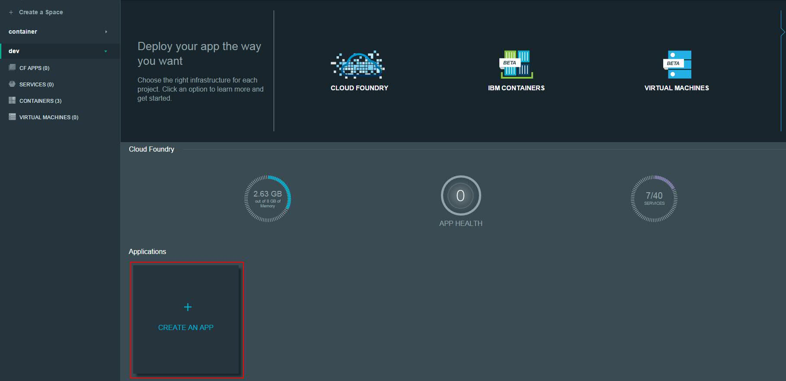
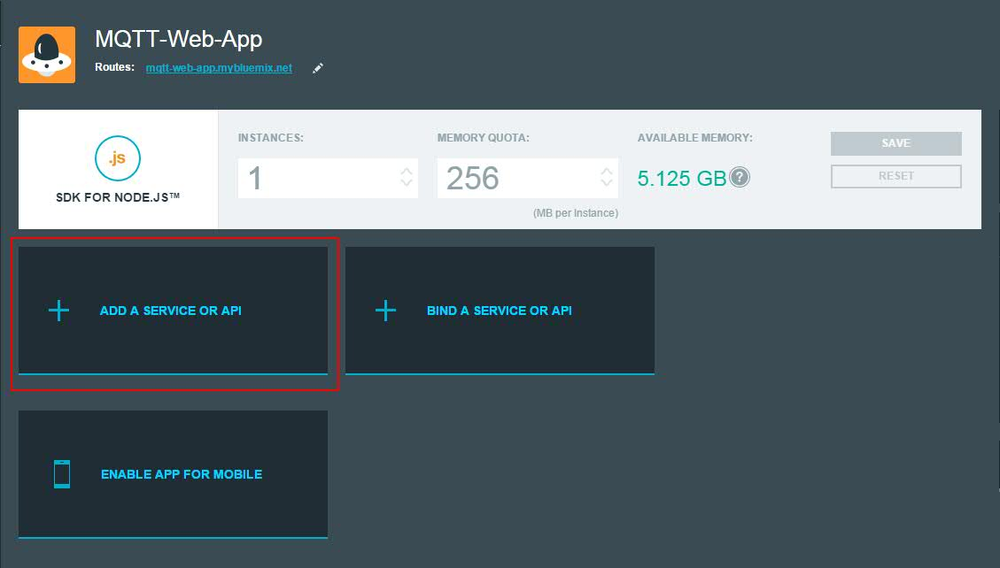
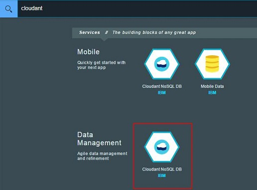
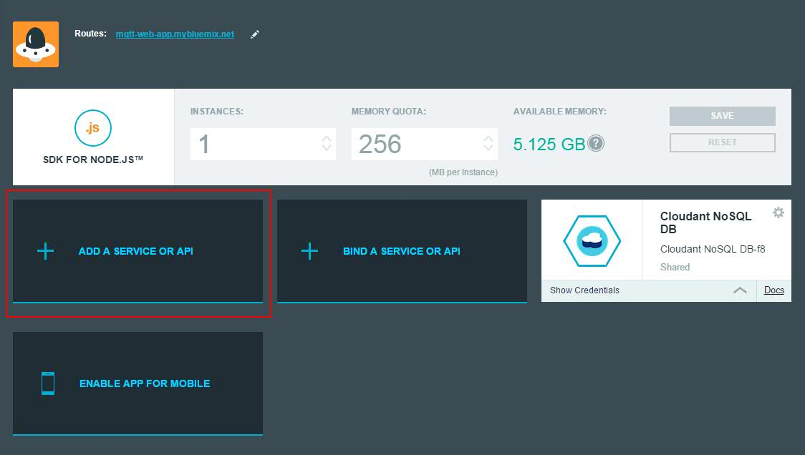
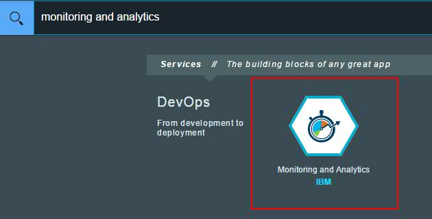
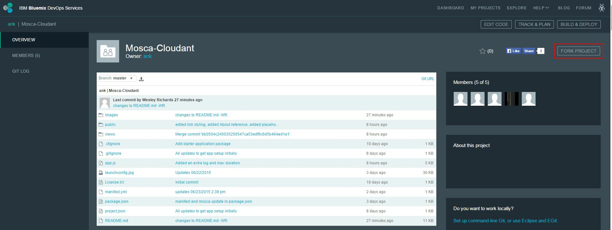
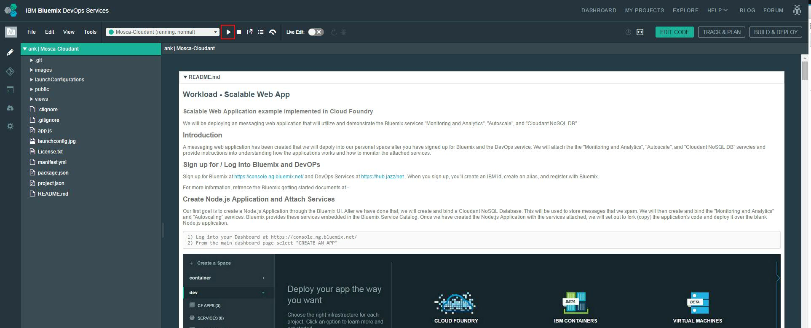
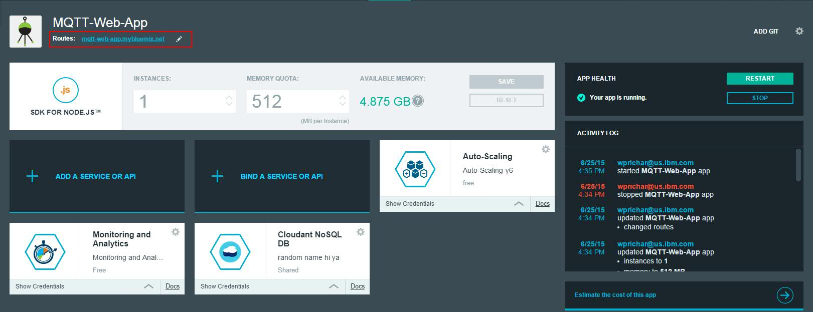
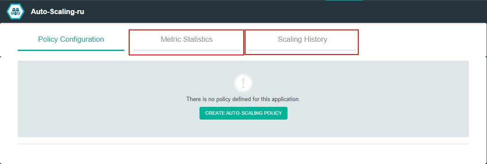
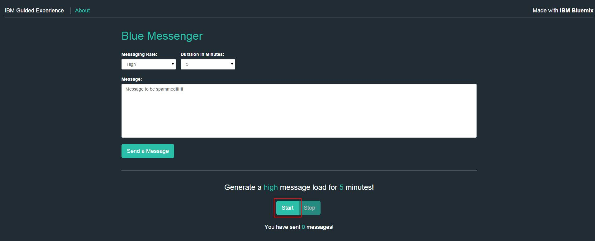

# Workload - Scalable Web App
	

###Scalable Web Application example implemented in Cloud Foundry 

The messaging web application utilizes and demonstrates
the Bluemix services "Monitoring and Analytics", "Autoscale", and "Cloudant NoSQL DB".

## Introduction

A messaging web application has been created so we can depoly it into our personal space
after signing up for Bluemix and the DevOps service. We will attach the
"Monitoring and Analytics", "Autoscale", and "Cloudant NoSQL DB" services and provide instructions
for understanding how the application works and how to monitor the attached services.  

## Sign up for / Log into Bluemix and DevOps

Sign up for Bluemix at https://console.ng.bluemix.net and DevOps Services at https://hub.jazz/net. When you sign up, you'll create an IBM id, create an alias, and register with Bluemix.

For more information, reference the Bluemix getting started documents at - 

## Create Node.js Application and Attach the Services
 
Our first goal is to create a Node.js application through the Bluemix UI. Afterward, we will create and bind
a Cloudant NoSQL Database. This will be used to store messages that we send. We will then create and bind the "Monitoring and Analytics"
and "Autoscaling" services. Bluemix provides these services embedded in the Bluemix Service Catalog. Once we have created a Node.js application
with these services, we will set out to fork (copy) the application's code and deploy it over the blank Node.js application.

	1) Log into your Dashboard at https://console.ng.bluemix.net.
    2) From the main dashboard page select "CREATE AN APP".
    

    
This will open a window to select either "Web" or "Mobile".
	
	3) Select "Web".
	4) In the next window, select "SDK for Node.js".
	

	5) In the next window, select "Continue".
	6) In the next window, where it says "App Name", give a name for your web application and select "FINISH".
	
It may take a while for the application to be created and staged. Once it finishes staging, you will have succesfully
created a blank Node.js application in Bluemix. You should now see the application in your main dashboard in the
"Applications" category. We will now bind services to our blank Node.js application. 

	1) From your dashboard, select your application you just created.

This will take you into the application's personal dashboard where we can add/bind services.

	2) In the application window select "ADD A SERVICE OR API".
	

The window that pops up is the Services Catalog. 

	3) In the top search bar type "cloudant" and select "Cloudant NoSQL DB".

	
This will bring up a box where you need to configure the Cloudant service.

	 In "Space" select your the space in which your blank Node.js application sits.
	 In "App" select your application.
	 In "Service name" field put any name you want.
	 In your "Selected Plan" select your desired plan.
	 Select "CREATE".

You have successfully deployed and binded an instance of Cloudant NoSQL DB to your blank Node.js application. 
For more information on Cloudant please see the docs at https://www.ng.bluemix.net/docs/#services/Cloudant/index.html#Cloudant.

At this point, we have our blank Node.js application with a binded instance of a Cloudant database. For this part of the tutorial, we will be adding
"Monitoring and Analytics" and "Auto-Scaling" services to the application.

	1) In the application window select "ADD A SERVICE OR API".

This will bring up the Bluemix Services Catalog.
	
	2) In the top search bar type "Monitoring and Analytics" and select "Monitoring and Analytics".

This will open a window where you will need to provide information about where to attach the service.

	 In "Space" field select your space where your blank Node.js application resides.
	 In "App" field select your application.
	 In "Selected Plan" field select your desired plan.
	 Select "CREATE" and then select "RESTAGE" when a window pops up.
	 (Your app may automatically restage.)
	 

 
You have now successfully attached the "Monitoring and Analytics" service to your web application.

	1) Go back to your application page and select "ADD A SERVICE OR API". 
	2) In the top search bar type "Auto-Scaling" and select "Auto-Scaling".

This will open a window where you will need to configure the service.

	In "Space" select your space where your blank Node.js application resides.
	In "App" select your application.
	In "Selected Plan" select your desired plan.
	Select "CREATE" and then select "RESTAGE" when a window pops up.
	(Your app may automatically restage.)

	
You have now successfully binded "Monitoring and Analytics" and "Auto-Scaling" services to your web application.

## Fork project to personal DevOps space 
	
Our next goal is to fork a publicly accessible repository hosted in http://hub.jazz.net into your 
personal DevOps space. Once we do this, we will be able to deploy the code to Bluemix and spin
up instances of the Web Application. 
	
	1) From https://hub.jazz.net/git/ank/Mosca-Cloudant select "Fork Project" in top right of the page.

 A menu will pop up where you will need to provide infomation on where the code will be forked 
	to.

	In the first field "Name your project" name the project the same name you named your blank node.js app.
	Check "Make it private" if you want the repo to be private; otherwise leave unchecked.
	Keep "Make this a Bluemix Project" checked.
	Select your Region, Organization, and Space as your blank Node.js app and select "Create". 

You have successfully forked this application code to your personal Jazz Hub space.
To find more about Bluemix's DevOps features reference the docs at 
https://hub.jazz.net/docs.

## Deploy to Bluemix through DevOps space

Next, we will take the repository, with the application code we just foked, and deploy over the the blank Node.js 
application we created. The services we created earlier will still be binded.

	1) From the DevOps project page you just created, select "EDIT CODE" at the top right.

In your "EDIT CODE" window  you will see the files that are contained in the application's code.

	2) In your "EDIT CODE" window, click the drop-down menu, found above the code files, and select the pencil symbol to edit launch configuration.

A window will pop up and you will be required to enter information about where the code will be
deployed to.

	 In the "Launch Config Name*" field give a Config Name.
	 In the "Target*" field select your app's region.
	 In the "Organization*" field select your app's organization.
	 In the "Space*" field select your app's Bluemix space.
	 In the "Manifest File" field leave the default of "manifest.yml".
	 In the "Application Name" field select the name of your blank Node.js application.
	 In the "Host" field select the hostname you gave for your Node.js application.
	 In the "Domain" field leave default at "mybluemix.net".
	 Click "Save".

]

	3) In your "EDIT CODE" window, select the "Play" button to deploy your application to Bluemix.

Once you click "Deploy", Bluemix will reference the launch configurations you specified and read your
manifest.yml in order to override your blank Node.js application.

## Monitoring Application Performance

Now, we will review how to utilize the "Monitoring and Analytics" service and obtain data on the
web application. 
	
For learning how to utilize the data provided in this service see
https://www.ng.bluemix.net/docs/#services/monana/index.html#gettingstartedtemplate.
	
	1) Return to your application's dashboard and the top of the screen you will see the listed routes.

These are your application's publicly accessible DNS names that can be used to launch your app from a browser.
	
	2) Click on any one of your routes to load the "Blue Messenger" application.

From the main page you will see a "Messaging Rate" dropdown where you specify the rate at which messages 
are sent to the database. In the "Duration in Minutes" dropdown, you can select how many minutes
the messaging will persist. In the "Message" box, you enter a message that will be sent to the database.
The message is optional. At the bottom of the webpage you will see "Start" and "Stop" buttons that you use
to initiate and stop the messaging.
	
	3) In the "Messaging Rate" box put any message you would like to send.
	4) Set the rate to "Medium".
	5) Set your duration to "5" minutes.
	6) Click "Start".

You have just succesfully started sending messages to the database. To see the messages populated, click on your
"Cloudant" service in the Application's Dashboard. Click on the "Monitoring and Analytics" service in your
Application's Dashboard to see and utilize the information you learned in the "Monitoring and Analytics" document 
referenced above. 

	

## Test Auto-Scaling

We are now going to stress our application and monitor the Auto-Scaling service at work.
	
First we must become familiar with the service by reading through the Bluemix documentation on Auto-Scaling at 
https://www.ng.bluemix.net/docs/#services/Auto-Scaling/index.html#autoscaling.

	1) From your application's dashboard select the "Auto-Scaling" Service.

In here you can utilize the Auto-Scaling service shown in the document referenced above.

	2) Create Auto-Scaling policy to do testing under the "Policy-Configuration" tab.

Once we start sending messages to stress the server, we can monitor auto-scaling from the "Metric Statistics"
and "Scaling History" tabs.

Start the stress so you can monitor auto-scaling from the 'Auto-Scaling' service.

	1) Reload the webpage for the application by selecting one of the routes.
	2) In the "Messaging Rate" box put any message you would like to send.
	3) Set the rate to "High".
	4) Set your duration to "5" minutes.
	5) Click "Start".

	
## DevOps Pipeline 

Here, we are going do an overview of the DevOps Pipeline service Bluemix provides so you can become familiar
how to utilize it for future changes to this or other applications.
	
	

## Getting Familiar with the Application

In section we are going to review the actual code and what the app is doing in the background. 

	
